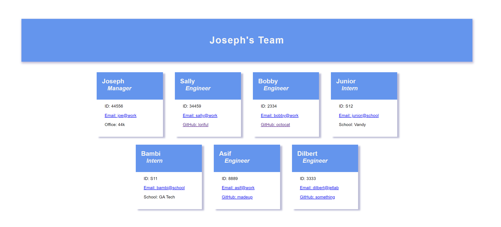

# **Team Profile Generator**
  
## **The Repository**
#### https://github.com/loriful/jester-plaid

## **Deployment:**

<a href="https://watch.screencastify.com/v/V2c23dUAXnHw7rfAMb1Y" alt="Application Walk Through Video">**Walk Through Video**</a>
  
## **Description**
Challenge 10:  Command-line application that takes in information about employees on a software engineering team and generates an HTML webpage that displays summaries for each person.

 
## **Table of Contents**
- [Description](#description)
- [Installation](#installation)
- [Usage](#usage)
- [Questions](#questions)

## **The Site View**

  

## **Installation**
- Requires Node, NPM Inquirer and jest packages.
## **Usage**
- Run with "node index.js" from the command line.  Follow prompts to enter data used to automatically build HTML file.

## **Questions**
### Github Profile:  https://github.com/loriful

### You may contact tiptonica@gmail.com with any questions related to this repository.

  
  